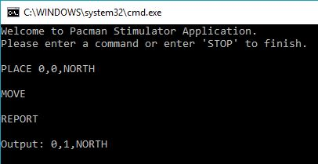
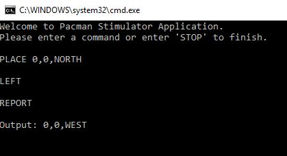
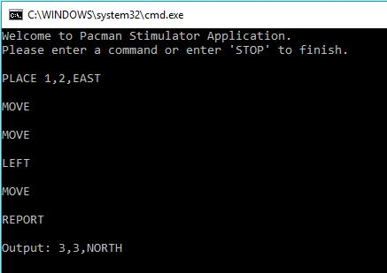
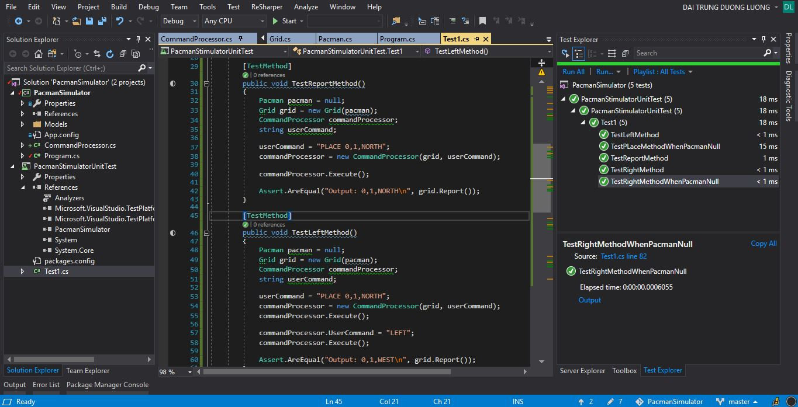

# Pacman Stimulator
IE Digital Coding challenge

## Table of Contents

* [Description](#Description)
* [Dependencies](#Dependencies)
* [Output](#Output)
* [UnitTesting](#UnitTesting)
## Description

This is a console application which is a simulation of Pacman moving on a grid. 

There are some methods is created by using Test Driven Development technique.
## Dependencies

The project is a console application using C# and .NET framework.

## Output
### Output 1

### Output 2

### Output 3

## UnitTesting
There are 5 test cases. All test cases are passed.

